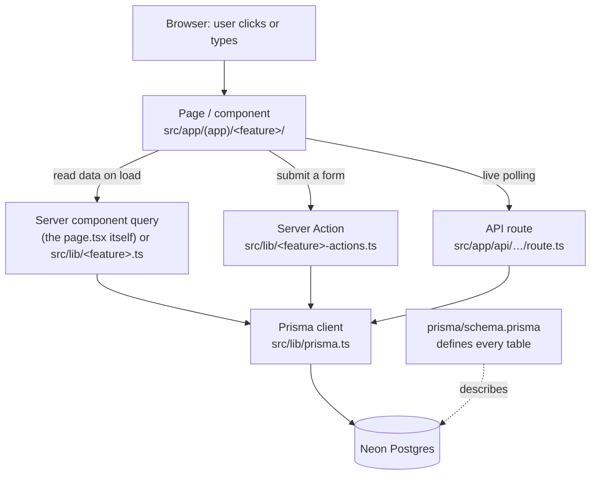

# AutoBD — Architecture & how it works

This document explains how the project is put together, so you can find "the
frontend" and "the backend" of any feature quickly.

## Why there is no separate `backend/` folder

AutoBD is a **Next.js** app. Unlike a PHP/Express setup, Next.js **co-locates
frontend and backend** — they live in the same files and folders, and Next.js
decides what runs in the browser vs. on the server. Two rules make this
non-negotiable:

1. Every page **must** live under `src/app/…/page.tsx` — that folder path *is*
   the URL. `src/app/(app)/new-cars/page.tsx` is the page at `/new-cars`.
2. Data-fetching and "server actions" (form submits) run **on the server**
   automatically, from those same files or from helpers in `src/lib/`.

So the project is organized **by feature**, and each feature has both a
frontend part and a backend part. Nothing is missing — it's just co-located.

## The layers

**In words:**

- **Frontend** = what the user sees → `src/app/(app)/<feature>/` (pages +
  components).
- **Backend, reading** = a page is a *server component*; it queries the database
  directly, sometimes via a helper in `src/lib/<feature>.ts`.
- **Backend, writing** = *server actions* in `src/lib/<feature>-actions.ts`
  (these run on the server when a form is submitted).
- **Backend, live/HTTP** = `src/app/api/.../route.ts` (used for polling — chat,
  live bids).
- **Database** = the Prisma client (`src/lib/prisma.ts`) talks to Neon Postgres.
  Tables are defined in `prisma/schema.prisma`.

## Feature-by-feature map

### 1. New Cars — `/new-cars`
| | Files |
| --- | --- |
| **Frontend** | `app/(app)/new-cars/page.tsx` (brands) · `[brand]/page.tsx` (models) · `[brand]/[car]/page.tsx` + `NewCarDetail.tsx` (detail) |
| **Backend** | `lib/new-car-actions.ts` (dealer inquiry) · `lib/test-drive-actions.ts` (test drive) · `lib/images.ts` (photo paths) |
| **Components** | `BrandMonogram`, `LocalPhoto`, `DealerMap`, `PhotoPlaceholder` |
| **DB tables** | `Brand`, `NewCar`, `NewCarVariant`, `Dealer`, `DealerInquiry`, `TestDriveReservation` |

### 2. Used Cars — `/used-cars`
| | Files |
| --- | --- |
| **Frontend** | `app/(app)/used-cars/page.tsx` (list) · `[id]/page.tsx` + `OfferForm.tsx` (detail) · `seller/page.tsx` (dashboard) |
| **Backend** | `lib/used-car-actions.ts` (make offer) · `lib/brta.ts` (registration paper value) |
| **DB tables** | `UsedCarListing`, `Offer` |

### 3. Reconditioned Import (Auctions) — `/auctions`
This is the biggest feature; it spans bidding through delivery.
| | Files |
| --- | --- |
| **Frontend** | `auctions/page.tsx` (agents) · `agents/[id]/page.tsx` (profile) · `…/sessions/page.tsx` · `…/[auctionId]/page.tsx` (lots) · `…/lots/[lotId]/page.tsx` + `BidControls` / `CostSidebar` / `LiveStats` / `live-lot-context` (the live bidding screen) · `…/telecast/page.tsx` + `TelecastFeed` |
| **Backend** | `lib/auction.ts` (live state, anti-snipe settle) · `lib/bid-actions.ts` (place bid) · `lib/bid-feed.ts` · `lib/wishlist-actions.ts` · `lib/engagements.ts` · `lib/agents.ts` · `lib/landed-cost.ts` + `landed-cost-server.ts` · `lib/fx.ts` (exchange rate) · `lib/chat.ts` + `chat-actions.ts` |
| **API (polling)** | `api/lots/[id]/state` · `api/lots/[id]/feed` · `api/conversations/[id]/messages` |
| **Post-win** | `escrow/[lotId]/` + `lib/escrow-actions.ts` · `shipment/[lotId]/` + `lib/shipment-actions.ts` + `lib/containers.ts` · `rating/[lotId]/` + `lib/rating-actions.ts` |
| **DB tables** | `Auction`, `AuctionCar`, `Bid`, `Wishlist`, `Engagement`, `Broadcast`, `Conversation`, `Message`, `Payment`, `Escrow`, `Shipment`, `ShipmentEvent`, `Container`, `ContainerBooking`, `Rating`, `Dispute` |

### 4. Modification Studio — `/modifications`
| | Files |
| --- | --- |
| **Frontend** | `app/(app)/modifications/page.tsx` + `ModStudio.tsx` (catalog + 3D tab) |
| **Backend** | `lib/fitment.ts` (chassis-code compatibility) · `lib/parts.ts` (types) |
| **DB tables** | `Part`, `PartFitment`, `ConfigCar`, `Rim`, `Spoiler`, `SavedBuild` |

### 5. Research Hub — `/research`
| | Files |
| --- | --- |
| **Frontend** | `app/(app)/research/page.tsx` (list) · `[slug]/page.tsx` + `TcoCalculator.tsx` (detail + cost calculator) |
| **Backend** | Data is read directly in the page; the TCO calculator runs in the browser |
| **DB tables** | `ResearchModel`, `ResearchIssue` |

### 6. AI Assistant — `/assistant`
| | Files |
| --- | --- |
| **Frontend** | `app/(app)/assistant/page.tsx` + `Assistant.tsx` (chat UI) |
| **Backend** | `lib/assistant-actions.ts` (entry point) · `lib/assistant/requirements.ts` (parse the request) · `lib/assistant/llm.ts` (optional LLM) · `lib/assistant/recommend.ts` (rank real inventory) |
| **DB tables** | reads across `NewCar`, `UsedCarListing`, `AuctionCar`, `ResearchModel` |

### Dashboards
| | Files |
| --- | --- |
| **Organization** | `app/(app)/org/page.tsx` · `lib/org-stats.ts` |
| **Admin** | `app/(app)/admin/page.tsx` + `AdminControls.tsx` · `lib/admin-actions.ts` · `lib/analytics.ts` |

## Trace one request end-to-end

**Example: a buyer sends a dealer inquiry on a New Car.**

1. **Frontend** — the buyer clicks "Submit dealer inquiry" in
   `app/(app)/new-cars/[brand]/[car]/NewCarDetail.tsx`.
2. That form calls the **server action** `submitInquiry` in
   `lib/new-car-actions.ts` — this runs **on the server**, not in the browser.
3. The action validates the buyer, then calls **Prisma**:
   `prisma.dealerInquiry.create(...)` (via `lib/prisma.ts`).
4. **Prisma** runs an `INSERT` into the `DealerInquiry` table in **Neon
   Postgres**.
5. The action calls `revalidatePath` so the page re-reads, and the UI shows
   "Inquiry sent."

Every feature follows this same shape: **component → server action/query →
Prisma → Postgres → back**.

## The shared foundation (used by every feature)

These aren't tied to one feature — they're the common base:

| File | Role |
| --- | --- |
| `lib/prisma.ts` | The one database connection every query uses |
| `prisma/schema.prisma` | Defines all ~35 tables |
| `src/auth.ts` + `lib/auth-actions.ts` | Login / register / sessions |
| `lib/session.ts` | "Who is signed in?" helpers used by every page |
| `lib/format.ts` | Money/number formatting (৳48L, ¥620,000) |
| `lib/settings.ts` | Admin-editable platform settings (duty, shipping, …) |
| `app/(app)/layout.tsx` + `components/AppHeader.tsx` | The shell around every page |

## Could each feature be its own self-contained folder?

Yes — the Next.js-idiomatic way is **co-location**: move a feature's backend
files *into* its route folder, e.g. `lib/new-car-actions.ts` →
`app/(app)/new-cars/actions.ts`. That keeps everything for one feature in one
place, without fighting the framework. The catch: genuinely shared code
(`prisma`, `session`, `format`, `settings`, exchange rate, landed-cost) has to
stay in `lib/` because several features use it. If you'd like this
reorganization, it can be done carefully — but the map above is usually enough
to understand and navigate the project.
